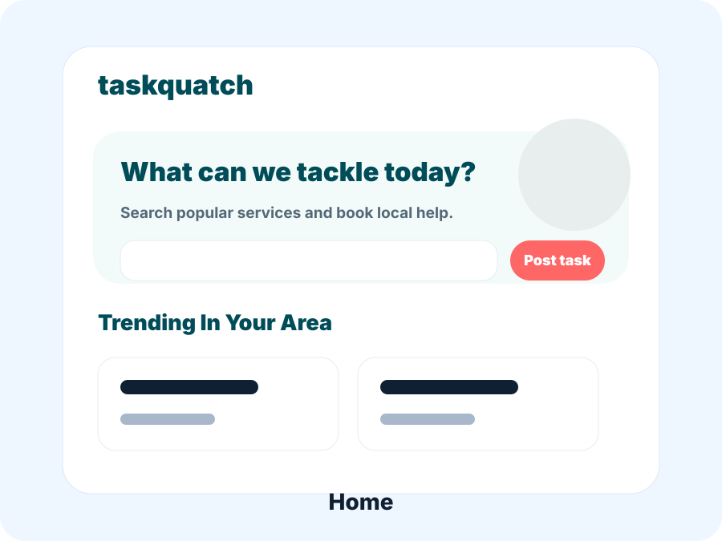
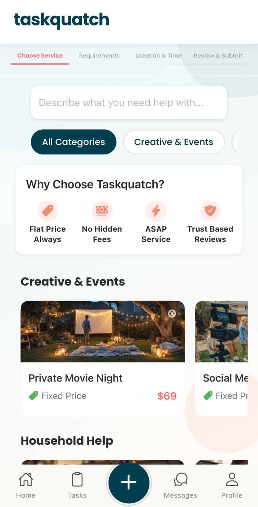
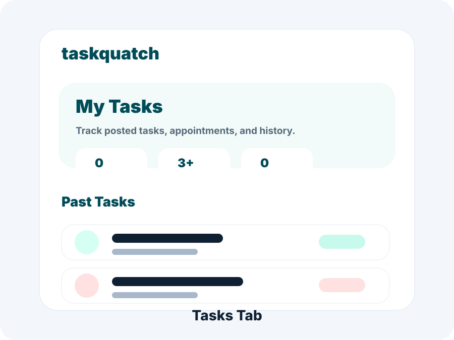
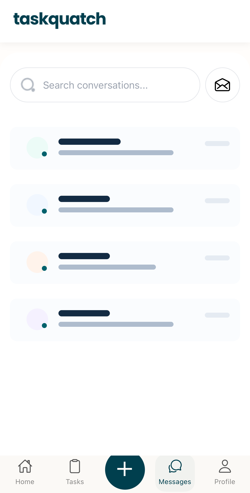
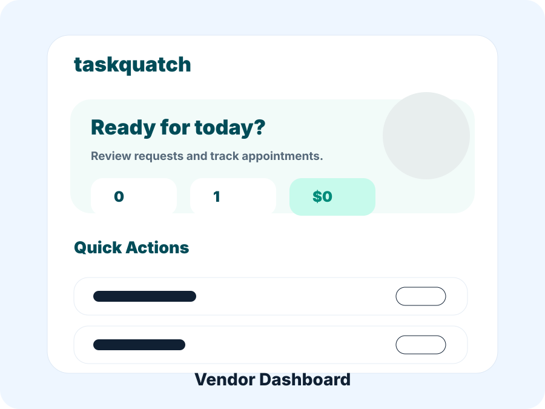
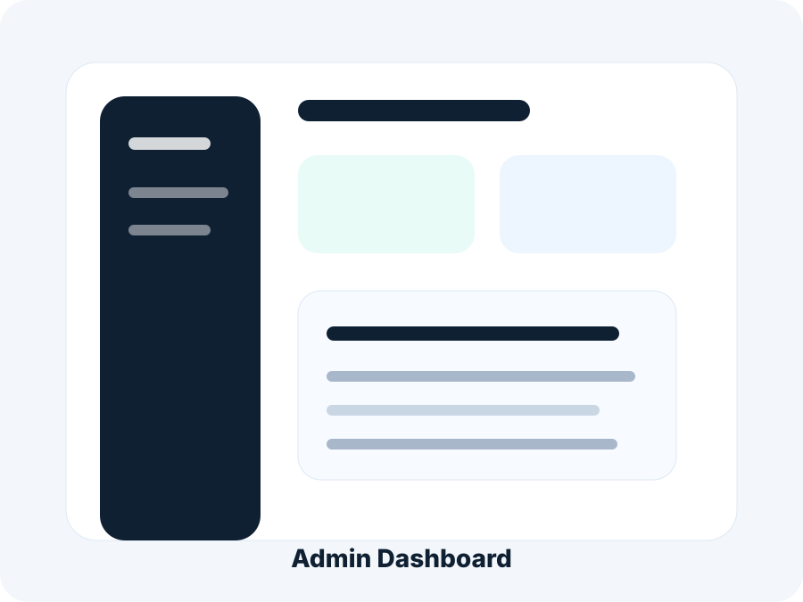
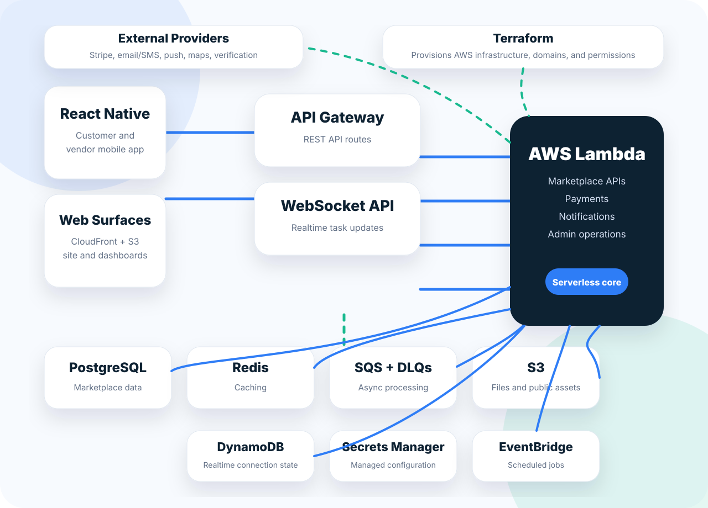

# Taskquatch Showcase


**Neighbors Helping Neighbors**

Taskquatch is a hyperlocal marketplace connecting neighbors with trusted local providers. This repository is the public GitHub entry point for the Taskquatch product showcase: product story, marketplace outcomes, architecture, operations, trust and safety, screenshots, and technical highlights.

Visit the live product: [taskquatch.app](https://taskquatch.app)

## View The Complete Showcase

- Open the full static showcase: [`index.html`](index.html)
- Review the public-safety scope: [`docs/showcase-scope.md`](docs/showcase-scope.md)
- If published with GitHub Pages, use this repository root as the Pages source.

This repository is intentionally a showcase, not a source-code mirror. It does not expose production application code, private backend implementation details, secrets, credentials, customer data, vendor data, payment records, or internal operational payloads.

## Marketplace Snapshot

- **5,000+ users**
- **500+ vendors**
- **100+ daily active users**
- **7 cities**

## Product Preview

The gallery uses public-safe mockups plus sanitized simulator captures. Screenshots are selected or edited to avoid exposing real user, vendor, payment, or operational data.













## What Taskquatch Does

Taskquatch brings together the major workflows needed to run a local services marketplace:

- **Task posting:** Neighbors describe what they need and publish local jobs.
- **Matching:** Relevant providers discover work based on service fit, location, and availability.
- **Payments:** Customers and providers move through a clear marketplace payment flow.
- **Vendor onboarding:** Providers create profiles, define services, and complete readiness steps.
- **Trust and safety:** Reviews, reports, verification, moderation, and provider context help protect marketplace quality.
- **Operations tooling:** Internal workflows support marketplace oversight, support, payouts, health checks, and growth operations.

## Case Study

**Problem:** Neighbors often need small local jobs completed quickly, while capable local providers need better access to nearby demand.

**Solution:** Taskquatch connects customers and providers through task posting, matching, messaging, payments, identity verification, support tooling, and marketplace operations workflows.

**Outcome:** The product grew into a multi-city marketplace with thousands of users, hundreds of vendors, and daily marketplace activity.

## Architecture

The architecture below is intentionally high level. It communicates the system shape without exposing proprietary implementation details.



- **React Native:** Mobile-first customer and vendor experiences.
- **Web surfaces:** Static hosting and CDN-backed marketing or operational surfaces.
- **API Gateway:** REST and WebSocket entry points for app traffic.
- **AWS Lambda:** Serverless marketplace APIs, payments, notifications, and operations workflows.
- **PostgreSQL:** Relational marketplace records, task state, users, and operational data.
- **Redis:** Caching for performance-sensitive app workflows.
- **SQS + DLQs:** Queue-backed background jobs and failure handling.
- **S3:** Public assets and file-oriented workflows.
- **DynamoDB:** Realtime WebSocket connection state.
- **External providers:** Stripe, live support chat, email/SMS, push notifications, maps, and verification integrations.
- **Terraform:** Infrastructure provisioning for AWS resources, domains, and permissions.

## Trust & Safety

Identity verification is part of the vendor onboarding and marketplace safety story. The public workflow is:

`Vendor Onboarding -> Secure Upload -> Protected Storage -> Verification Provider -> Operations Review -> Marketplace Access`

This public repo intentionally excludes provider payloads, exact routes, webhook details, storage paths, secret names, and proprietary review logic.

## Marketplace Operations

Taskquatch includes operational systems for running a two-sided marketplace:

- Vendor approvals and onboarding review
- Task lifecycle visibility
- Customer support workflows
- Payout oversight and reconciliation support
- Content moderation and reporting
- Health/status visibility for key marketplace flows

Taskquatch also includes support and alerting integrations such as live support chat and Slack-based operational notifications, helping shorten response times for customer issues, vendor workflows, and reliability events.

## Reliability & Automation

The platform uses background automation to keep marketplace activity moving:

- Queue-backed workflows with dead-letter handling
- Scheduled jobs for reminders, recurring tasks, and maintenance workflows
- Health checks for important API surfaces
- Error reporting for production awareness
- Notification processors for customer and provider communication
- Realtime task status updates with mobile fallback behavior

## Payments & Payouts

The public payment workflow is intentionally outcome-focused:

`Task Completed -> Payment Captured -> Platform Fee Applied -> Vendor Payout -> Reconciliation`

This avoids Stripe implementation details, payment identifiers, internal exceptions, and financial records.

## Growth Systems

Taskquatch combines product and growth infrastructure to support local marketplace expansion:

- Referral flows
- Coupons and promotional incentives
- Marketing landing pages
- Lifecycle email and push messaging
- Local service and category content

## Admin Tooling

The showcase references broad internal tooling categories without exposing private dashboards or operational records:

- User support
- Vendor review
- Task monitoring
- Content reports
- Payout oversight
- Health checks
- Marketing operations
- Data export support

## Technical Highlights

- React Native
- Node.js
- AWS
- Terraform
- Stripe
- Docker
- PostgreSQL
- SQS
- Redis
- DynamoDB
- S3 / CloudFront

## Repository Structure

```text
taskquatch-showcase/
├── README.md
├── index.html
├── styles.css
├── script.js
├── screenshots/
├── assets/
│   ├── logo.png
│   ├── architecture.svg
│   └── favicon.ico
└── docs/
```

## Running Locally

No build system is required. Open `index.html` directly in a browser, or serve the folder with any static file server.

```bash
python3 -m http.server 8080
```

Then visit `http://localhost:8080`.

## Public Scope

This repository intentionally excludes:

- Production application source code
- Backend implementation details
- Credentials, secrets, tokens, environment files, or private infrastructure state
- Customer, vendor, payment, or operational records
- Internal admin logic, private APIs, logs, webhooks, payloads, or identifiers
- Proprietary business logic

## About The Builder

Designed, built, and operated end-to-end by Guy Cherkesky.
